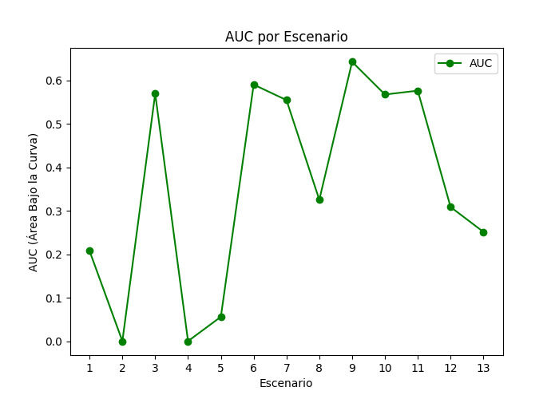
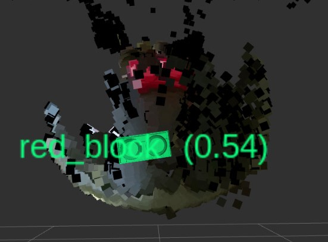

English | [Spanish](README_ES.md)

# Object Detection and Pose Estimation using DOPE

In this GitHub repository, I present a project using [DOPE (Deep Object Pose Estimation)](https://github.com/NVlabs/Deep_Object_Pose) created by NVIDIA and utilizing a Kinect One for object detection in the robotics lab at the Universidad Veracruzana. The goal is to integrate this detection into a UR3 collaborative robot to improve human-robot interaction.

# Creation of the 3D Model

For the creation of the 3D model, I used a MegaBlock object available in the lab. This object is appropriately sized for the robot's gripper to manipulate without issues.

  

I used two different 3D models: one downloaded online and another created by me with more realistic textures.

  

Using the 3D generator Luma Genie. By capturing photos or videos of the object from different angles, a detailed 3D model was constructed. Then, I used Blender tools to fine-tune and perfect the model, achieving a result that closely resembles the physical object with more realistic textures.

    

# Dataset Creation
## First Training

For the first training, a dataset of 122,000 images of the 3D model downloaded online was created using NVIDIA's NVISII library to generate synthetic data. The training was conducted with the code provided by DOPE, with 60 epochs and a batch size of 32.

### Resultados

The model was evaluated using 13 different scenarios with the MegaBlock in various sizes. The two MegaBlock models were used to see how accurately it could detect these two 3D models with different textures.

| Scenario  | Average Value         | Standard Deviation     | Detection Proportion       | AUC (Area Under the Curve) |
|-----------|-----------------------|------------------------|----------------------------|----------------------------|
| 1         | 9.906870236548304     | 8.730089099172021      | 26/100                     | 0.20766666666666667        |
| 2         | 0                     | 0                      | 0/97                       | 0                          |
| 3         | 4.771360665213297     | 0.8868278656527507     | 62/98                      | 0.5700680272108845         |
| 4         | 0                     | 0                      | 0/56                       | 0                          |
| 5         | 6.436392145667369     | 0.5776193611652325     | 6/93                       | 0.05602150537634409        |
| 6         | 5.293908563697143     | 3.1369345456007554     | 63/95                      | 0.590719298245614          |
| 7         | 4.684177619601435     | 1.0287874131013346     | 59/96                      | 0.5550868055555556         |
| 8         | 4.625755644287643     | 0.5151881786961665     | 36/100                     | 0.32550000000000007        |
| 9         | 5.2688453378081785    | 2.9757212741715073     | 70/97                      | 0.6431271477663231         |
| 10        | 5.875605982198354     | 4.223917584430453      | 62/96                      | 0.5678819444444444         |
| 11        | 4.919218770038036     | 1.8306451578183642     | 61/95                      | 0.5767894736842105         |
| 12        | 6.936023622666627     | 3.092900978172489      | 18/50                      | 0.3088666666666667         |
| 13        | 7.887882671293061     | 5.648607756930215      | 15/50                      | 0.25156666666666666        |

  
  

  
  

  
  

  
  

  
  

  
  

  
  

  
  

  
  

  
  

  
  

  
  

  
  

  
  

## Second Training

In the second training, a dataset of 44,159 images with the textured MegaBlock was created. I used the model resulting from the first training to continue training, incorporating these new images.

### Results

The same 13 scenarios from the previous training were used to evaluate the model.

| Scenario  | Average Value         | Standard Deviation     | Detection Proportion       | AUC (Area Under the Curve)|
|-----------|-----------------------|------------------------|----------------------------|---------------------------|
| 1         | 4.02547667734152      | 0.294854334004394      | 91/100                     | 0.83365                   |
| 2         | 4.377124507780992     | 0.43501046908819674    | 83/97                      | 0.7780584192439861        |
| 3         | 4.130707876763564     | 0.4020600413911343     | 75/98                      | 0.6995068027210882        |
| 4         | 4.6499566270695905    | 1.1398785953953645     | 18/56                      | 0.2905357142857144        |
| 5         | 0                     | 0                      | 0/93                       | 0                         |
| 6         | 8.144268537909856     | 7.508623363573066      | 26/95                      | 0.2282105263157895        |
| 7         | 5.769006510502794     | 4.948573048197892      | 76/96                      | 0.6977777777777777        |
| 8         | 6.320994475258116     | 5.935781714203715      | 45/100                     | 0.3916833333333333        |
| 9         | 6.177859527555418     | 4.102924083124736      | 66/97                      | 0.5941580756013746        |
| 10        | 4.187575275960723     | 3.0834220546541466     | 64/96                      | 0.6087152777777779        |
| 11        | 5.600144265583258     | 5.270232251595552      | 61/95                      | 0.5680877192982456        |
| 12        | 4.269599060253238     | 1.865569930913061      | 43/50                      | 0.7837                    |
| 13        | 7.277334876754938     | 4.532606123822793      | 19/50                      | 0.32343333333333335       |

  
  

  
  

  
  

  
  

  
  

  
  

  
  

  
  

  
  

  
  

  
  

  
  

  
  

  
  

# Model Comparison

Although the second model shows better detection compared to the first, it still has some limitations in precision.

  

    
Model 1

    
  

  

    
Model 2

    
  

  
  

  
  

  
  

  
  

  
  

  
  

  
  

  
  

  
  

  
  

  
  

  
  

# Additional Evaluations

An additional evaluation was conducted in a real environment, placing the MegaBlock in 12 different positions, moving it from point A to point B, and measuring accuracy at distances of 30 and 60 centimeters. A confusion matrix was generated for each pose.

  <h3>Object 30 centimeters away from the camera.</h3>

  
  

  
  

  
  

  
  

  
  

  
  

  
  

  
  

  
  

  
  

  
  

  
  

  <h3>Object 60 centimeters away from the camera.</h3>

  
  

  
  

  
  

  
  

  
  

  
  

  
  

  
  

  
  

  
  

  
  

  
  

# Modifying DOPE

DOPE includes a section for using the model with ROS, but it uses the object's pose estimation and visualizes it in a virtual environment. When comparing this with the point cloud provided by the Kinect One, there is a significant discrepancy in the object's location. To address this, the code was modified to use the depth image provided by the Kinect One to calculate the object's depth and achieve a more accurate location. This was the result obtained.

  

    
Unmodified code

    
  

  

    
Modified code

    
  

# Models and Weights

This repository includes the link to download two CAD 3D models of the object used in this training, as well as the Weights resulting from Training 1 and Training 2 [here](https://www.dropbox.com/scl/fo/z30ti4oiv12qbn281dkuf/AEr40yvWAVrmIc_vCb0TDj0?rlkey=fd04rh7bbsy77robgp27h6cdy&st=sh39y3ep&dl=0).
